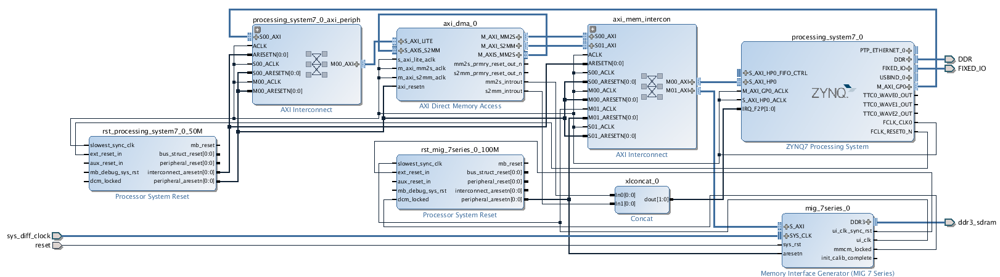

# zynq-linux-dma
A user space DMA example on Zynq platform (ZC706) under Petalinux.
## Environment Requirement
### EDK Versions
Vivado 2014.4 with corresponding Petalinux SDK.
### Hardware Platform
ZC706 Evaluation Board. 
## Hardware Architecture 

This project implements a self-looped DMA connecting with both PL and PS DDRs. The PL DDR is invisible to Linux running on PS. Data can be moved between (1) PS and PL DDRs, (2) PS and PS DDRs, and (3) PL and PL DDRs from programs in user space. The hardware can be built from the `hw/system.tcl`.
## Software Flow
### Create Modules
``` bash
petalinux-create -t modules --name xdma --enable
```
Replace files in `./component/modules/xdma` with those from `sw/modules/xdma`.
### Create Apps
``` bash
petalinux-create -t apps --name xdma-demo --enable
```
Replace files in `./component/apps/xdma-demo` with those from `sw/apps/xdma-demo`.
### Build Projects
``` bash
petalinux-built
```
### Run Deme
After booting kernel, we can load drivers and run demos.

``` bash
insmod /lib/modules/`uname -r`/extra/xdma.ko
```
Run the demo:

``` bash
/bin/xdma-demo
```
## Acknowledgement
Thanks for bmartini and John. This is a slightly modified version of [bmartini](https://github.com/bmartini/zynq-xdma)'s, and an implementation of [John](http://forums.xilinx.com/t5/Embedded-Linux/AXI-DMA-with-Zynq-Running-Linux/m-p/522755#M10649)'s idea. 